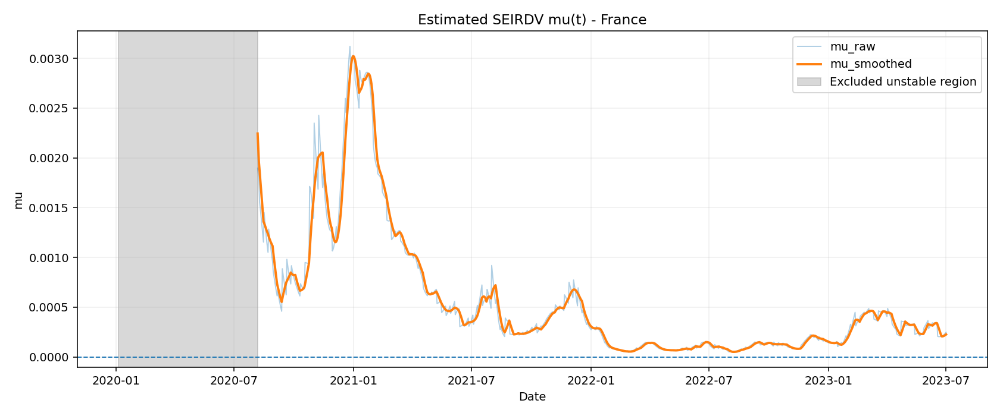
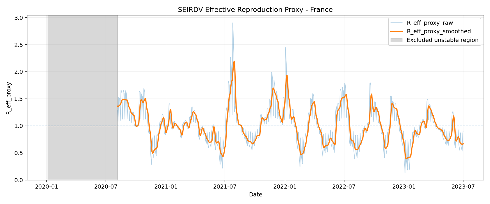
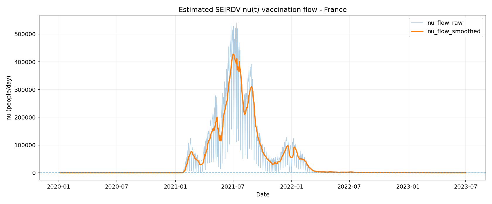

# Résultats SEIRDV (France) à partir des graphiques

## 1. Périmètre et objectif

Ce document synthétise les résultats obtenus avec le pipeline SEIRDV sur la France (fenêtre `2020-01-05` à `2023-07-01`, 1274 jours). L’objectif est de présenter les paramètres dynamiques estimés, d’expliquer leur méthode d’estimation, puis d’interpréter les variations observées d’un point de vue épidémiologique.

Les figures présentées ici sont volontairement limitées à `mu(t)`, `R_eff(t)` et `nu(t)`.

## 2. Rappel de la méthode d’estimation

Le modèle utilisé est :

```text
dS/dt = -beta(t) * S * I / N - nu(t) * S
dV/dt =  nu(t) * S - (1 - epsilon_v) * beta(t) * V * I / N
dE/dt =  beta(t) * S * I / N + (1 - epsilon_v) * beta(t) * V * I / N - sigma * E
dI/dt =  sigma * E - gamma * I - mu(t) * I
dR/dt =  gamma * I
dD/dt =  mu(t) * I
```

Configuration principale utilisée :

- `latent_period_days = 5` donc `sigma = 0.2`
- `infectious_period_days = 14` donc `gamma = 0.07142857`
- `death_delay_days = 14`
- `epsilon_v = 0.6` (efficacité vaccinale fixe)
- dérivée numérique `gradient`
- lissage par moyenne glissante (`window = 7`)
- exclusion des zones instables par règle robuste médiane + MAD

Formules de calcul effectivement employées dans le code :

```text
beta(t) ~= [dE/dt + sigma * E_t] / [((S_t + (1 - epsilon_v) * V_t) * I_t) / N]
mu(t) ~= Delta_D_window(t) / Sum_window(I_lagged)
Reff(t) ~= [beta(t) / (gamma + mu(t))] * [S_t + (1 - epsilon_v) * V_t] / N
nu(t) ~= dV/dt (approché par différence finie, puis lissé)
```

## 3. Qualité d’ajustement observée

Sur cette exécution, les performances de reconstruction sont élevées :

- Cas : `R2 = 0.9808`, `RMSE = 7429.7`, `MAE = 2278.8`
- Décès : `R2 = 0.9333`, `RMSE = 42.25`, `MAE = 21.97`

Ces scores soutiennent une bonne cohérence entre signaux observés et flux reconstruits, en particulier pour l’analyse des tendances de paramètres.

## 4. Valeurs estimées des paramètres

### 4.1 Valeurs numériques (séries lissées)

| Paramètre | Moyenne | Médiane | P05 | P95 | Min (date) | Max (date) |
|---|---:|---:|---:|---:|---|---|
| `beta_smoothed` | 0.1588 | 0.1469 | 0.0603 | 0.3116 | 0.0374 (2020-11-21) | 0.3627 (2022-09-23) |
| `mu_smoothed` | 0.000568 | 0.000323 | 0.000067 | 0.002051 | 0.000051 (2022-08-08) | 0.003022 (2020-12-31) |
| `R_eff_proxy_smoothed` | 1.0160 | 0.9878 | 0.5401 | 1.5385 | 0.3941 (2023-01-08) | 2.1936 (2021-07-30) |
| `nu_flow_smoothed` (pers/jour) | 41,752 | 656 | 0 | 261,543 | 0 (2020-01-05) | 428,123 (2021-07-01) |

Informations complémentaires utiles :

- `R_eff > 1` pendant 513 jours et `< 1` pendant 547 jours (sur 1060 jours valides).
- Le pic de vaccination journalière est cohérent avec la phase d’accélération de la campagne en 2021.

### 4.2 Évolution temporelle (moyennes annuelles)

- `beta_smoothed` : 2020 = 0.082, 2021 = 0.116, 2022 = 0.228, 2023 = 0.198
- `mu_smoothed` : 2020 = 0.00134, 2021 = 0.000836, 2022 = 0.000117, 2023 = 0.000306
- `R_eff_smoothed` : 2020 = 1.146, 2021 = 1.038, 2022 = 1.016, 2023 = 0.866
- `nu_smoothed` (pers/jour) : 2020 ≈ 0, 2021 ≈ 135,490, 2022 ≈ 10,120, 2023 ≈ 244

Lecture épidémiologique : la mortalité conditionnelle `mu(t)` baisse fortement après 2020, la vaccination est maximale en 2021, et `R_eff` revient progressivement vers des niveaux plus contrôlés en 2023.

## 5. Figures (mu, R_eff, nu)

## 5.1 `mu(t)`



Interprétation : les pics de `mu(t)` apparaissent surtout au début des vagues les plus sévères, puis la tendance centrale baisse avec l’amélioration de la prise en charge et l’immunisation. Une remontée ponctuelle peut survenir selon la structure d’âge des infectés et la pression hospitalière.

## 5.2 `R_eff(t)`



Interprétation : quand `R_eff > 1`, la dynamique est expansive; quand `R_eff < 1`, la dynamique est régressive. La série oscille autour de 1, ce qui est cohérent avec des successions de phases de reprise et de contrôle.

## 5.3 `nu(t)`



Interprétation : `nu(t)` reflète la dynamique de campagne vaccinale. La montée rapide en 2021, puis la décroissance en 2022-2023, suit la logique d’une phase de montée en charge suivie d’un régime de rappels plus ciblé.

## 6. Comparaison à la littérature COVID-19

La cohérence globale est bonne pour un modèle agrégé national :

- `beta(t)` est du bon ordre de grandeur pour des modèles SEIR journaliers (valeurs de l’ordre de quelques dixièmes selon périodes, interventions et variants).
- `R_eff(t)` reste centré autour de 1 sur longue période, avec excursions au-dessus et en dessous, ce qui correspond aux observations publiées sur les vagues successives.
- `mu(t)` est un taux dynamique conditionnel aux infectieux reconstruits, pas une IFR stricte. Son niveau plus élevé en début de pandémie puis sa baisse est qualitativement cohérent avec la littérature.
- L’efficacité vaccinale fixée (`epsilon_v = 0.6`) est plausible comme moyenne agrégée, mais simplifie fortement la réalité (dépendance au temps, aux variants et aux rappels).

Point important de lecture : transformer `mu` en proxy de fatalité de type `mu/(gamma+mu)` donne une médiane proche de `0.45%` et un P95 proche de `2.8%`. Ces niveaux restent plausibles pour des phases hétérogènes, mais doivent être interprétés avec prudence car ils dépendent de la reconstruction des états et des délais.

## 7. Note sur le graphe `beta(t)`

Le code de visualisation a été modifié pour construire `beta(t)` avec le même style que les autres paramètres (courbe brute, courbe lissée, zone instable exclue). La figure mise à jour est :

- `outputs/figures/seirdv/covid_france_seirdv_beta_estimates.png`

Elle n’est pas affichée ici pour respecter la contrainte de ne présenter que `mu(t)`, `R_eff(t)` et `nu(t)`.
